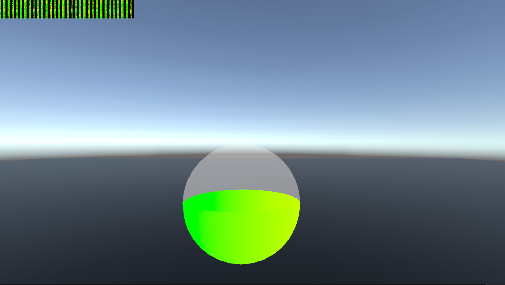

# Screenspace Data Example

Hey gamers here is an example showing a geometry shader encoding multiple per-vertex attributes into a grid of screenspace pixel blocks. This exports the data directly without the need for cameras.

This data is captured into a CRT through the use of a grabpass where a different shader can perform arbitrary computations on said data. 

Then we read the result of said computations to mesh attributes when actually drawing the mesh.

#### Credits: 

[CNLohr](https://github.com/cnlohr) - [CRT read/write boilerplate](https://github.com/cnlohr/flexcrt).

[Merlin](https://github.com/MerlinVR) - [Functionality for encoding and decoding screenspace data](https://gist.github.com/float3/3bd231ffe66e46f97958c26b42beff39).

[Pema99](https://github.com/pema99) - [Helpful articles and tips](https://github.com/pema99/shader-knowledg). Specifically:
  - [Encoding and decoding Data in a grabpass](https://github.com/pema99/shader-knowledge/blob/main/tips-and-tricks.md#encoding-and-decoding-data-in-a-grabpass) 
  - [Easy way to show UV unwrap in clipspace](https://github.com/pema99/shader-knowledge/blob/main/tips-and-tricks.md#easy-way-to-show-uv-unwrap-in-clipspace) 
  - [Blitting to camera loops or cameras in general](https://github.com/pema99/shader-knowledge/blob/main/geometry-shaders.md#blitting-to-camera-loops-or-cameras-in-general) 

