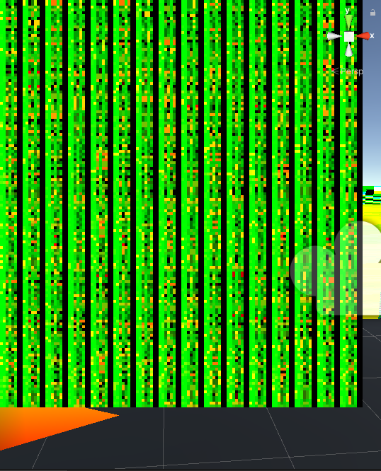

# GrabpassTest
2019.4.30f1

Emits 7 fields per vertex of a mesh to screen using grabpass and then reads them back using a camera to perform a computation; however, it is currently broken. Instead we get much triangle soup after reading back computation result from texture. Much sadness.

Special thanks to cnlohr and pema99 for the help.